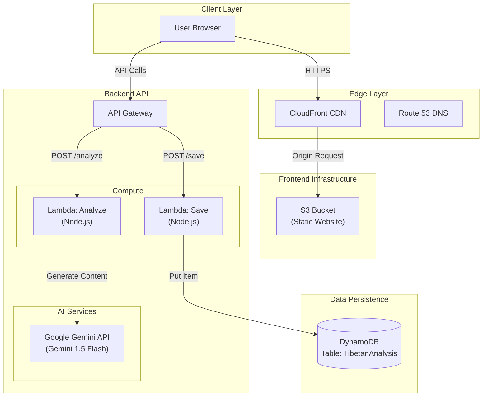

# System Architecture: Tibetan LLM Tools

This document details the cloud architecture for the Tibetan LLM Tools application. The system is designed to be serverless-first, cost-effective, and scalable, leveraging AWS managed services to minimize operational overhead.

## High-Level Architecture

The application follows a standard 3-tier web architecture adapted for cloud-native services:
1.  **Presentation Layer**: Static single-page application (SPA) served via CDN.
2.  **Application Layer**: Serverless compute (Lambda).
3.  **Data Layer**: NoSQL key-value store (DynamoDB) and object storage (S3).

### Architecture Diagram

---

## Component Details

### 1. Frontend (Presentation Layer)
*   **Technology**: React 18, Vite.
*   **Hosting**: **Amazon S3** configured for static website hosting.
*   **Delivery**: **Amazon CloudFront** provides a global Content Delivery Network (CDN) to cache assets (HTML, CSS, JS) at the edge.
*   **Security**: CloudFront handles SSL/TLS termination.

### 2. Backend API (Application Layer)
*   **Gateway**: **Amazon API Gateway** (REST API) serves as the entry point for all backend logic.
*   **Compute**: **AWS Lambda** functions execute business logic on-demand.
    *   **`analyze` Function**: Receives Tibetan text and invokes **Google Gemini API**.
    *   **`save` Function**: Persists analysis results to DynamoDB.
*   **AI Integration**: **Google Gemini API** (Gemini 1.5 Flash) is used for text analysis.

### 3. Data Layer
*   **Database**: **Amazon DynamoDB** is used for its single-digit millisecond latency and serverless scaling.
    *   **Table Name**: `TibetanAnalysisTable`
    *   **Partition Key**: `userId` (String)
    *   **Sort Key**: `timestamp` (Number)
    *   **Billing Mode**: On-Demand (Pay-per-request)

### 4. Infrastructure as Code (IaC)
*   **Tool**: **AWS CDK (Cloud Development Kit)** using TypeScript.
*   **Stacks**:
    *   `FrontendStack`: Defines S3, CloudFront, and asset deployment.
    *   **`BackendStack`**: Defines DynamoDB, Lambda, API Gateway.

## Security Considerations
*   **IAM Roles**: Lambda functions have dedicated IAM roles.
*   **API Keys**: The Gemini API Key is passed to the Lambda function as an environment variable (`GEMINI_API_KEY`).
*   **Encryption**: DynamoDB and S3 are encrypted at rest.

## Scalability
*   **Serverless**: Lambda, API Gateway, and DynamoDB scale automatically.
*   **CDN**: CloudFront offloads traffic from the origin.
