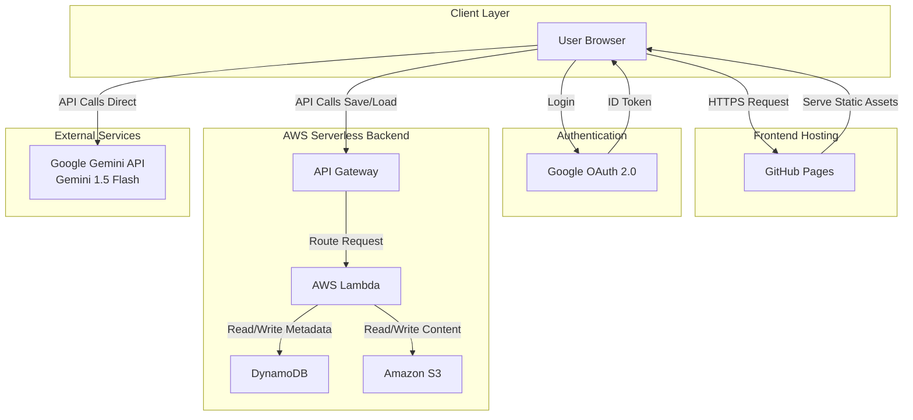

# System Architecture: Tibetan LLM Tools

This document details the architecture for the Tibetan LLM Tools application. The system is designed as a hybrid application: a client-side static frontend hosted on GitHub Pages, and a serverless backend on AWS for user data persistence.

## High-Level Architecture

The application follows a modern serverless web architecture:
1.  **Presentation Layer**: Static single-page application (SPA) built with React and Vite.
2.  **Hosting**: GitHub Pages (Frontend).
3.  **Authentication**: Google OAuth 2.0 (Implicit Flow).
4.  **Backend**: AWS Serverless (Lambda, API Gateway).
5.  **Data Storage**: Amazon DynamoDB (Metadata) and Amazon S3 (File Content).
6.  **AI Integration**: Direct integration with Google Gemini API (client-side).

### Architecture Diagram

---

## Component Details

### 1. Frontend (Presentation Layer)
*   **Technology**: React 18, Vite.
*   **Hosting**: **GitHub Pages**.
*   **Deployment**: Automated via **GitHub Actions**.
*   **State Management**: React Context API (`SelectionContext`, `AuthContext`).
*   **Authentication**: `@react-oauth/google` for Google Sign-In.

### 2. Backend (Serverless Layer)
*   **Infrastructure as Code**: AWS CDK.
*   **API Gateway**: HTTP API exposing Lambda functions.
*   **AWS Lambda**: Node.js functions for business logic:
    *   `save_file`: Saves file content to S3 and metadata to DynamoDB.
    *   `list_files`: Queries DynamoDB for user's files.
    *   `get_file`: Retrieves file content from S3.
*   **Storage**:
    *   **DynamoDB**: Stores file metadata (filename, userId, timestamp). Partition Key: `userId`, Sort Key: `filename`.
    *   **S3**: Stores the actual file content (JSON/Text). Key: `{userId}/{filename}`.

### 3. AI Integration
*   **Service**: **Google Gemini API** (Gemini 1.5 Flash).
*   **Integration Pattern**: Direct client-side calls using the Google Generative AI SDK.

## Security Considerations
*   **Authentication**: Google OAuth 2.0 ensures secure user identity.
*   **Authorization**: Backend validates Google ID Tokens before allowing access to user data.
*   **Data Isolation**: Users can only access their own files (enforced by `userId` from the ID Token).
*   **API Keys**: Gemini API keys are managed client-side (user input or local storage).

## Scalability
*   **Frontend**: GitHub Pages handles static asset scaling automatically.
*   **Backend**: AWS Serverless (Lambda/DynamoDB/S3) scales automatically with demand.
